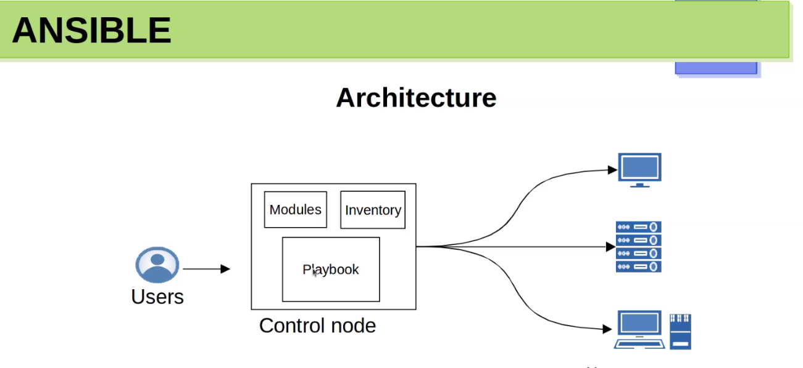

What is Ansible?
-- Open source tool used for IT automation which is owned and maintained by Red Hat. 
-- Configure, system, deploy software, and orchestrate more advanced IT tasks such as Continuous deployments or zero downtime rolling update. 
-- simple, applicability, supported environment. 
-- secure and reliable (Supports OpenSSH protocol and other alternatives)
-- no dedicated master, agentless
-- systems management in scale. 

------------------------------------------------------------------------------------------------------------------------------------------------
Terminology
-=-=-=-=-=-=-=
-- Node : means a device, contorl node -- where the ansible is ran by.   no actual server.
-- Inventry - Managed node or host managed which as kept in inventory. 
-- Module   - package used by ansible such as ping modulee
-- Plugins  - plugins work with ansible contorl nodes to enhane updates and features.  
-- Task     - work or specific work given by the user. 
-- Ad-hoc command - cli command to execute. by direct module to execute by cli
-- Playbook - to execute from a file. 

=-----------------------------------------------------------------------------------------------------------------------------------------------
Ansible
========--

------------------------------------------------------------------------------------------------------------------------------------------------
Install
-----------
https://docs.ansible.com/ansible/latest/installation_guide/intro_installation.html

for specific os. 
----------------
https://docs.ansible.com/ansible/latest/installation_guide/installation_distros.html

== Create bash script or simply copy and past to the terminal.==
$ sudo apt update
$ sudo apt install software-properties-common
$ sudo add-apt-repository --yes --update ppa:ansible/ansible
$ sudo apt install ansible

-------------------------------------------------------------
Prerequisites:
===============
- Control nodes.  the vm or pc or a device where we run ansible from.
    - Windows not supported 
    - Python 3.8 or new
    - Placement Decision

- Managed Nodes.
    - ssh, SFTP/SCP
    - Phthon 2.6 above  or python 3.5 above.
    - libselinux-python for redhat distro with selinux.
----------------------------------------------------------------------
Configuration:
---------------
 - ansible.cfg 
    - ANSIBLE_CONFIG (Environment variable if set)
    - ansible.cfg (in current directory)
    - ~/.ansible.cfg (in the home directory)
    - /etc/ansible/ansible.cfg
- inventory/Host file
    - < current direcotry >

-----------------------------------------------------------------------------------------------------------------------

