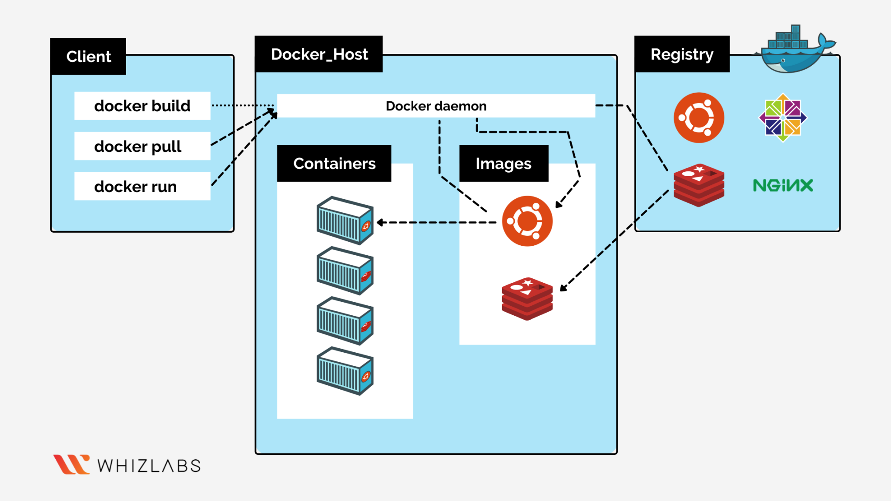

Docker:

Virtulization 
- technology to create isolated environments to run applications on hardware resource. 

Virtual Machines vs Containers
-- both are virtulization solutions used to create virtual environments isolated from underlying hadware.
-virtual Machines
    - runs on top of Hypervisor,  a software helps to devide physical resources into multiple virtual systems. 
    - has its own completely isolated OS inculding kernel, binaries, libraries and apps. 
- Containers    
    - runs on top os host OS and virtulizes just the os instead of physical server. 
    - shares os kernel and just included apps with their libries and dependenci-es.

Benefits of Containers.
-----------------------
 - lightweight, less time to boot and portable.
 - fast in scaling. 
 - independent of underlying infrastructure.
 - favorable for microservice architecture. 
 - source control friendly
 - ideal for automation and CI/CD pipeline implementation.

What is a Docker?
- software framework for building, running, managing and shipping containers 
- it is a client-server architecture. 

Docker Daemon (dockerd) :
- listens for API requests, and manges Docker objects such as images, conatiners, networks and volumes. 

Docker Client:
- tool to interact with docker daemon.

Docker Desktop:
- tool for MAC and Windows to run docker. 

Docker Registries:
- store for docker images.

Docker Objects
    - Images:  Read-only template with instructions for creating docker container
    - Containers : Isolated environments run from image.
    - DockerFile: file with set of instructions to tell container to what to do when it gets built. 
            - we use this file to create image. 

<h2>Docker Architecture</h2>
-----------------------------

------------------------------------------------------------------------------------------------------

