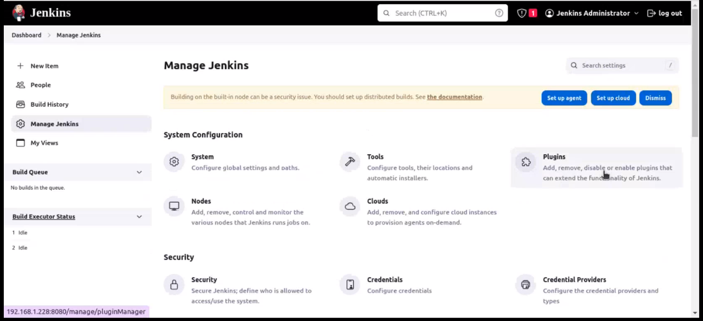
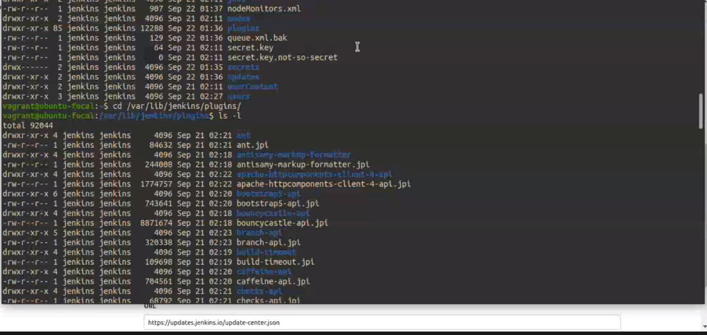
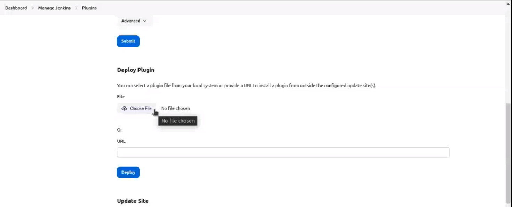

<h1>Jenkins </h1>

- open source automation Server
- can be used to automate all sorts of tasks related to building, testing and delivering or deploying software.
- easy to setup and configure through UI (User Interface)
- Integration with wide range of plugins.
- workload distribution with master-slave architecture. 

-------------------------------------------------------

<h3> Install </h3>
We can install by 2 ways, 

1. [Jenkins-install.sh](Jenkins-install.sh)
2. [Jenkins-through-war-file](Jenkins-through-war)

--------------------------------------------------------
Click on Manage Jenkins >> Plugins

From here We download the needed plugins with our required plugin names. 
>> Available Plugins   -- we search for the required plugins.
>> installed plugins   -- to view the installed plugins. 

For now we add plugins; 
1. Git plugin
2. Dependency plugin
3. Node Js

----------------------------------------------------

Those plugins will be available in cli at /var/lib/jenkins/plugins
-- if we need to copy the files extension of jpi, (which is custom or previous build plugins).

-- We can get into Advance settings in plugin, and look for deploy plugin for gui manual install. 

---------------------------------------------------------
we can set up Graddle, Mavan and Nodejs, global properties > environmental variable,JDK Installation,

